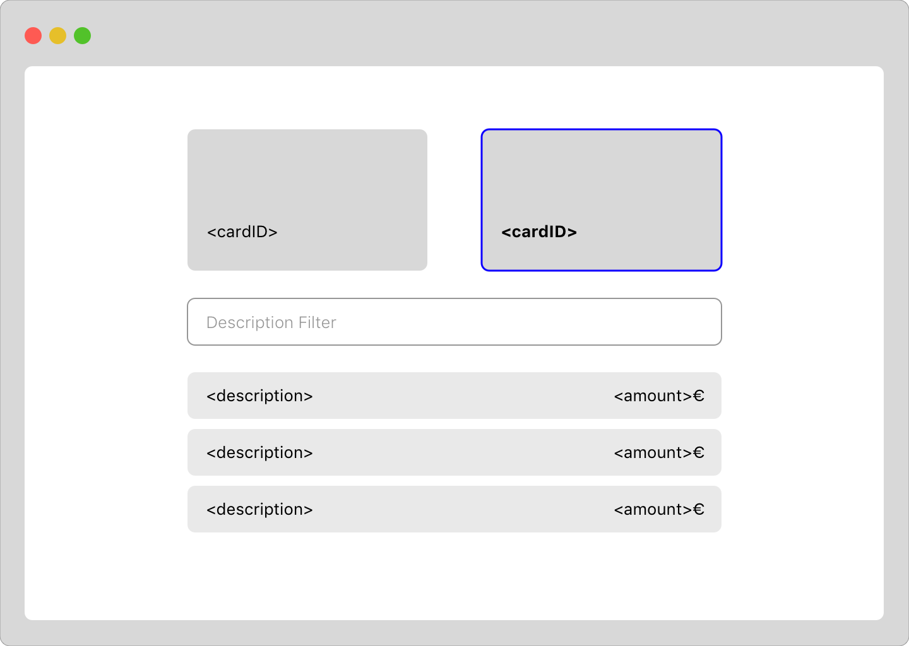

<h1>Cards and Transactions</h1>

<!-- TOC -->

- [Description](#description)
- [Acceptance Criteria:](#acceptance-criteria)
- [Resources](#resources)

<!-- /TOC -->

# Description

The task is to develop a simple screen displaying 2 bank cards and transactions belonging to each card. The attached image gives a visual overview of how the page is intended to look like.

The user should be able to select one of the cards, see it's transactions and be able to filter the transactions. More details below in acceptance criteria.

# Acceptance Criteria:

- User can select one of the cards
- Selected card has a visual indication of being selected.
- The transactions of the selected card will be displayed.
- There should be a filter affecting the transactions of the transactions of the selected card.
- The user can filter transactions by inputting description text to the filter fields. Transactions with a matching descriptions will stay visible.
- If card is being changed while there is content in filter field, the field will be emptied.
- If the user changes a selected card and there is content in the filter fields, the content should be resetted.

# Resources

_Visual representation of the screen_
